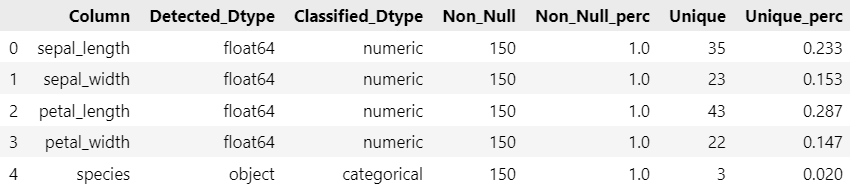

# EDADataFrame

## What is it / what does it do?

The EDADataFrame purpose is to simplify the process of data exploration. To do that,
the class EDADataFrame is built upon de pandas DataFrame with the inclusion of some new
methods that returns a basic visualization of the state of the data (datatypes, completeness,
uniquenes...), search of duplicated rows or finding outliers among other usual tasks.

## Examples
--------

    >>> import EDADataFrame
    >>> import seaborn as sns
    >>>
    >>> iris = sns.load_dataset('iris')
    >>> iris_eda = EDADataFrame(iris)
    >>> iris_eda.general_info()
    DataFrame's shape: 5 columns by 150 rows
    Number of incomplete rows (with one or more null values): 0 out of 150 (0.0%)
    Categorical Attributes: (Can be modified through method 'set_cat_attr')
	    ['species']
    Numerical Attributes: (Can be modified through method 'set_num_attr')
	    ['sepal_length', 'sepal_width', 'petal_length', 'petal_width']
    Date Attributes: (Can be modified through method 'set_date_attr')
	    []

